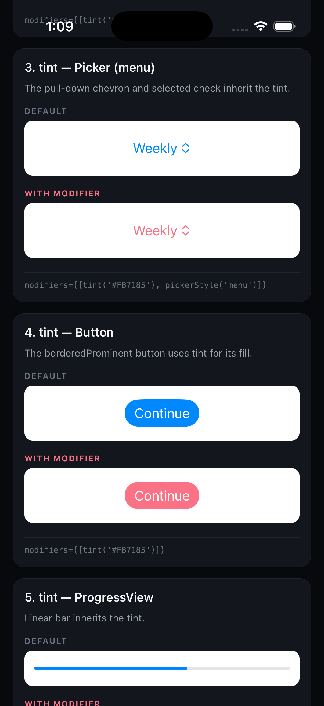
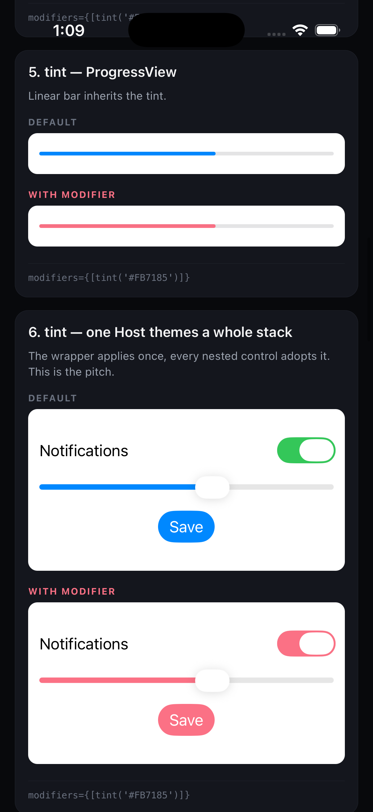
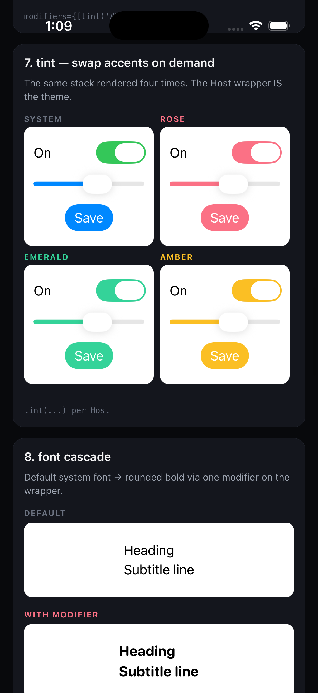
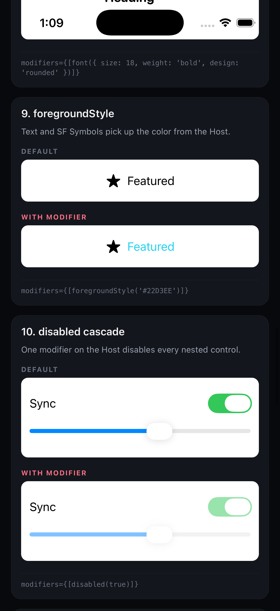
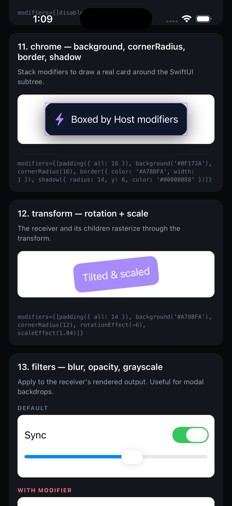
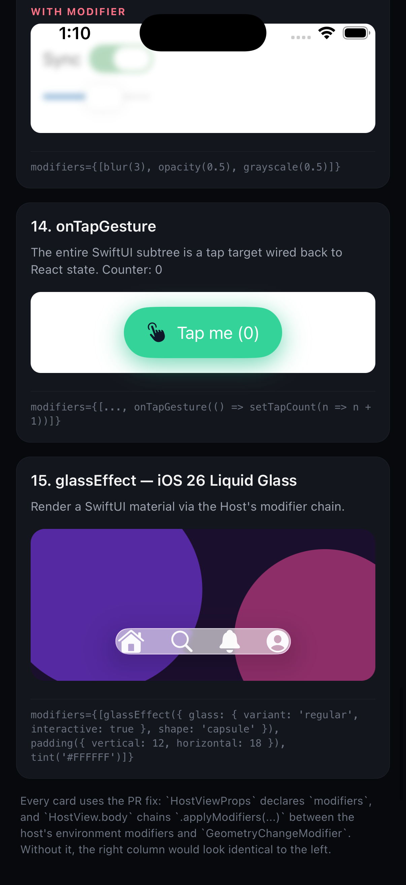

# expo-ui Host modifiers iOS repro

Wanted to apply `tint`, `font`, `padding`, `glassEffect`, or any other SwiftUI modifier through a `<Host>` from `@expo/ui/swift-ui` and realized the `modifiers` prop typechecked but did nothing on iOS. Filed [`expo/expo#45872`](https://github.com/expo/expo/pull/45872) to fix it. This repo is the minimal repro so maintainers and reviewers don't have to spend time recreating one to validate the PR.

| Toggle and Slider | Picker, Button, ProgressView | ProgressView and whole stack | Four accents from one wrapper |
|---|---|---|---|
|  |  |  |  |

| font, foregroundStyle, disabled | chrome, transform, filters | filters, onTapGesture, iOS 26 Liquid Glass |
|---|---|---|
|  |  |  |

## Run

You need Xcode with an iOS simulator and Node 22 or later.

```bash
npm install                              # postinstall applies the patch
npx expo prebuild --platform ios --clean
npm run ios
```

First build takes a few minutes while Xcode compiles the dev client and the patched `@expo/ui`. After that JS edits hot-reload through Metro.

## What's on the home screen

`App.tsx` renders 15 cards. Each card mounts the same SwiftUI subtree twice. Once in a default `Host` with no modifiers, once in a `Host` wrapped in a modifier chain. With the patch applied, the right column visibly differs. Remove the patch and both columns look identical.

| # | Card | What to confirm |
|---|---|---|
| 1 | tint, Toggle | Default toggle is system green. With modifier it is rose. |
| 2 | tint, Slider | Default track is system blue. With modifier the track is rose. |
| 3 | tint, Picker menu | Pull-down chevron and selected check go rose. |
| 4 | tint, Button | `borderedProminent` fill flips from blue to rose. |
| 5 | tint, ProgressView | Linear bar flips from blue to rose. |
| 6 | tint, whole stack | `Toggle`, `Slider`, `Button` all recolor from one wrapper. |
| 7 | four accents | Same stack rendered four times in different tints. The wrapper is the theme. |
| 8 | font cascade | System font swaps to rounded bold 18pt. Both text lines pick it up. |
| 9 | foregroundStyle | Star symbol and label both adopt cyan. |
| 10 | disabled cascade | One `disabled(true)` on the Host greys out every nested control. |
| 11 | chrome | `background`, `cornerRadius`, `border`, `shadow`, `padding` stack into a real card. |
| 12 | transform | `rotationEffect(-6)` and `scaleEffect(1.04)` tilt and enlarge the receiver. |
| 13 | filters | `blur`, `opacity`, `grayscale` muddy the controls. Useful for modal backdrops. |
| 14 | onTapGesture | The SwiftUI pill is a tap target wired back to React state. Counter increments per tap. |
| 15 | glassEffect | iOS 26 Liquid Glass capsule over a colorful gradient. iOS 26 only. |

Two iOS quirks worth knowing about. `Stepper` and `Picker(.segmented)` do not visibly pick up `tint` because they use the system fill regardless. `Picker(.menu)` does adopt the tint, which is what card 3 shows.

## Verify the bug

Remove the patch, reinstall, rebuild. Every "WITH MODIFIER" column should now look identical to the "DEFAULT" column.

```bash
trash patches/@expo+ui+56.0.8.patch
trash node_modules ios
npm install
npx expo prebuild --platform ios --clean
npm run ios
```

## License

MIT.
