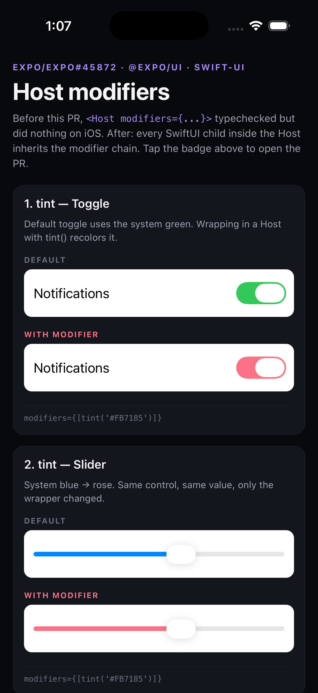
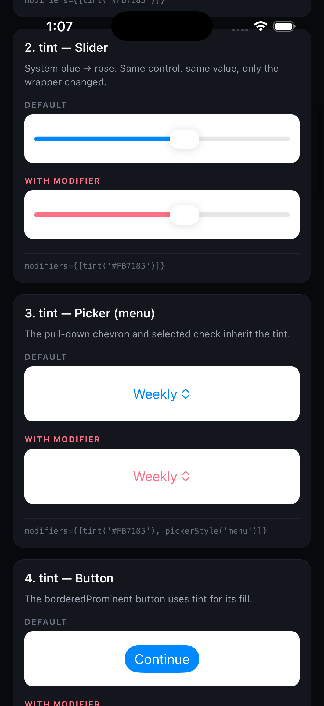
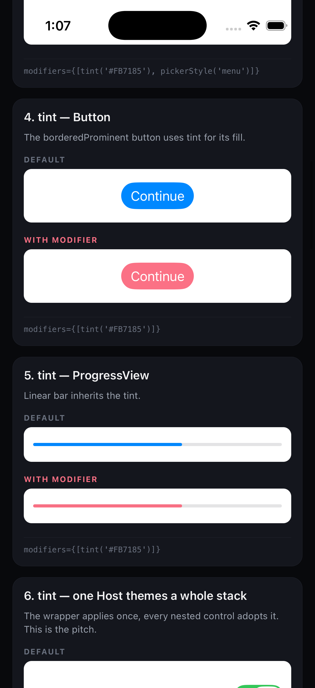
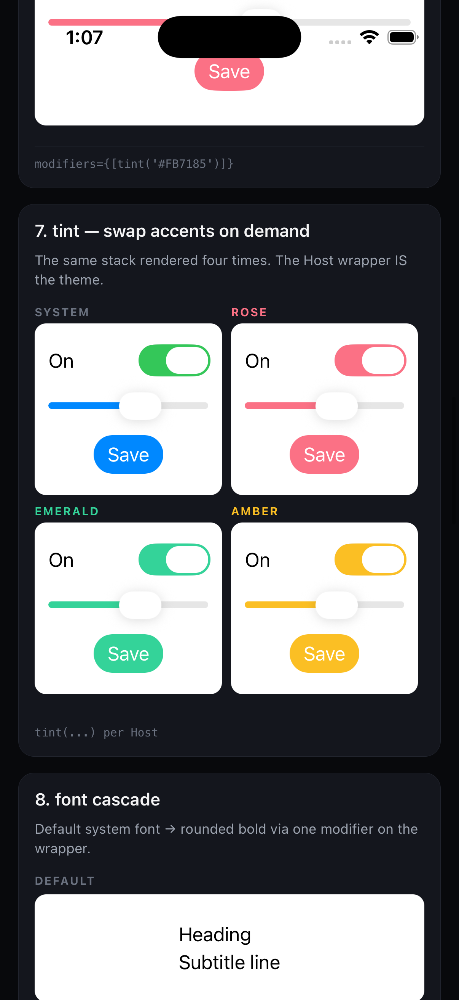
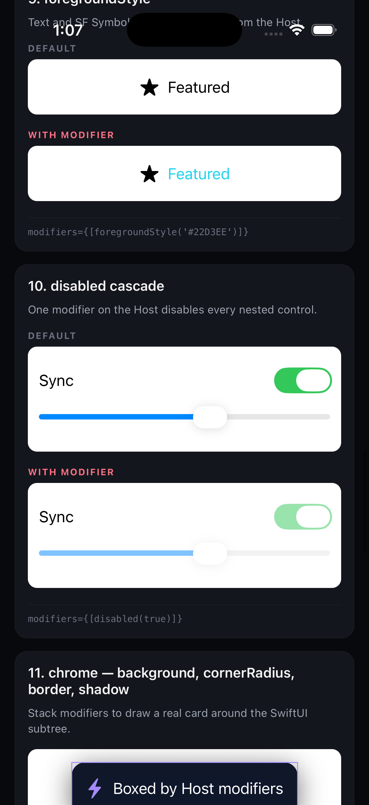
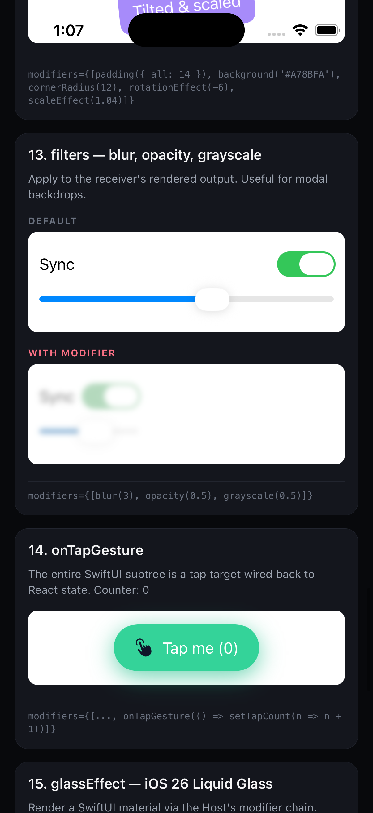
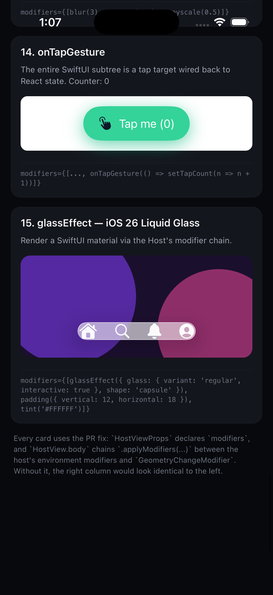

# @expo/ui Host modifiers — iOS repro

Wanted to apply a `tint`, `font`, `padding`, `glassEffect`, or any other SwiftUI modifier through a `<Host>` from `@expo/ui/swift-ui` and realized the `modifiers` prop typechecked but did nothing on iOS. Filed [`expo/expo#45872`](https://github.com/expo/expo/pull/45872) to fix it. This repo is the minimal repro so maintainers and reviewers don't have to spend time recreating one to validate the PR.

| Header + tint on Toggle + Slider | tint on Picker (menu) + Button | tint on Button + ProgressView + whole stack |
|---|---|---|
|  |  |  |

| Same form, four accents | font cascade + foregroundStyle | disabled cascade + chrome |
|---|---|---|
|  |  |  |

| transforms + filters + onTapGesture | onTapGesture + iOS 26 Liquid Glass |
|---|---|
|  |  |

## Run

You need Xcode with an iOS simulator (or device) and Node.

```bash
npm install                              # postinstall applies the patch
npx expo prebuild --platform ios --clean
npm run ios
```

First build takes 5-10 minutes while Xcode compiles the dev client and `libExpoUI.a` with the patched `HostView.swift`. After that, JS edits hot-reload through Metro.

## The bug

`@expo/ui`'s `HostProps` (TypeScript) extends `CommonViewModifierProps`, and the JS in `Host/index.tsx` forwards `modifiers` to the native view. The Swift side, `HostViewProps`, did not declare a `modifiers` field, so the prop was silently dropped during deserialization. Every `<Host modifiers={[tint(...)]}>` typechecked but rendered as if no modifier had been passed.

## The fix

Two changes in `node_modules/@expo/ui/ios/`:

- **`HostView.swift`** — adds `@Field var modifiers: ModifierArray?` to `HostViewProps` and chains `.applyModifiers(...)` inside `body`, between the host's environment modifiers and `GeometryChangeModifier`. The chain order matters: layout-affecting modifiers (`frame`, `padding`) must run before `GeometryChangeModifier` so the resulting size feeds back into the React Native shadow tree.
- **`ExpoUIModule.swift`** — splits the `// MARK:` so the section labeled "Views don't support common view modifiers" no longer misrepresents `HostView` and `TextView`, which apply common view modifiers internally.

The full patch is at `patches/@expo+ui+56.0.8.patch` and is applied by `npm postinstall`.

## What's on the home screen

`App.tsx` renders 15 side-by-side cards. Each card mounts the same SwiftUI subtree twice, once in a default `Host` (no modifiers), once in a `Host` wrapped in a modifier chain. With the patch applied, the right column visibly differs. Remove the patch and both columns are identical.

| # | Card | What to confirm |
|---|---|---|
| 1 | tint — Toggle | DEFAULT renders the system green. WITH MODIFIER renders rose. |
| 2 | tint — Slider | DEFAULT track is system blue. WITH MODIFIER track is rose. |
| 3 | tint — Picker (menu) | DEFAULT chevron is blue. WITH MODIFIER chevron is rose. |
| 4 | tint — Button | `borderedProminent` Button: DEFAULT fill is blue, WITH MODIFIER fill is rose. |
| 5 | tint — ProgressView | DEFAULT bar is blue, WITH MODIFIER bar is rose. |
| 6 | tint — one Host themes a whole stack | `Toggle`, `Slider`, `Button` together: WITH MODIFIER recolors all three from one wrapper. |
| 7 | tint — swap accents on demand | Same stack four times: System / Rose / Emerald / Amber. The wrapper IS the theme. |
| 8 | font cascade | DEFAULT system font, WITH MODIFIER bold rounded 18pt. Two SwiftUI `Text` lines both pick it up. |
| 9 | foregroundStyle | Star symbol + "Featured" text: DEFAULT primary color, WITH MODIFIER cyan. |
| 10 | disabled cascade | One `disabled(true)` on the Host greys out every nested control. |
| 11 | chrome — background, cornerRadius, border, shadow | A SwiftUI subtree wrapped in a stack of chrome modifiers renders as a real card. |
| 12 | transform — rotation + scale | `rotationEffect(-6)` + `scaleEffect(1.04)` tilt and enlarge the receiver. Children rasterize through the transform. |
| 13 | filters — blur, opacity, grayscale | DEFAULT crisp controls, WITH MODIFIER blurred and desaturated, useful for modal backdrops. |
| 14 | onTapGesture | Entire SwiftUI pill is a tap target wired back to React state. Counter increments per tap. |
| 15 | glassEffect — iOS 26 Liquid Glass | `glassEffect` capsule over a colorful gradient. iOS 26 only. |

## Expected non-changes

A couple of controls won't visually change under `tint`. This is iOS behavior, not a bug of the patch.

- **`Stepper`** — the `+ / -` chrome uses `secondaryFill` regardless of tint.
- **`Picker(.segmented)`** — segment background uses `secondarySystemFill`, label uses `label`. `Picker(.menu)` does respect tint (chevron + selected check), which is what card 3 demonstrates.

## Prerequisites

- Node 22+
- Xcode 16+ (tested on 26.5)
- iOS Simulator on iOS 16+ for everything except card 15
- iOS 26 simulator (or device) for card 15 `glassEffect`

## Verify the bug

Remove the patch, reinstall, rebuild. Every "WITH MODIFIER" column should now look identical to the "DEFAULT" column.

```bash
trash patches/@expo+ui+56.0.8.patch
trash node_modules ios                  # patch-package needs a clean install to skip the patch
npm install
npx expo prebuild --platform ios --clean
npm run ios
```

## Layout

```
.
├── App.tsx                          # the demo (15 sections)
├── README.md
├── app.json
├── index.js                         # registerRootComponent(App)
├── package.json                     # 6 runtime + 3 dev deps
├── tsconfig.json
├── patches/
│   └── @expo+ui+56.0.8.patch        # auto-applied by npm postinstall
└── screenshots/                     # what's in this README
```

## Dependency floor

Six runtime deps, can't go lower without breaking `@expo/ui`:

- `@expo/ui` — the subject
- `expo` — framework
- `react`, `react-native` — core
- `react-native-reanimated`, `react-native-worklets` — declared `@expo/ui` peer deps (imported at module top-level for worklet-marked callbacks on `TextField`, `Slider`, and `useNativeState`)

## License

MIT.
